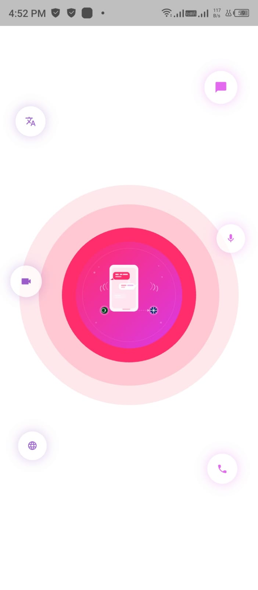
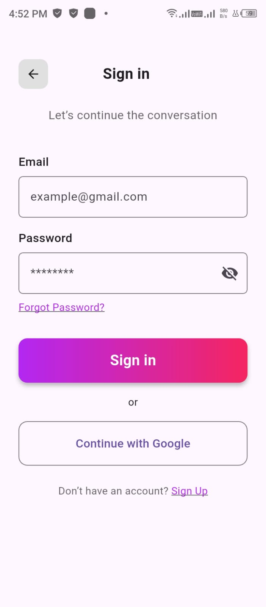
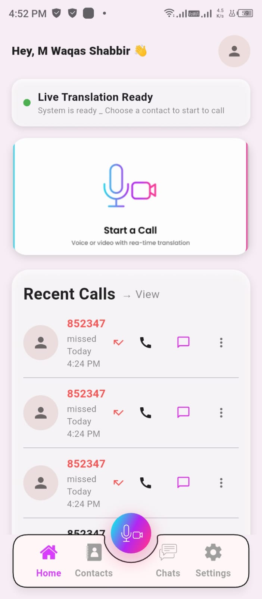
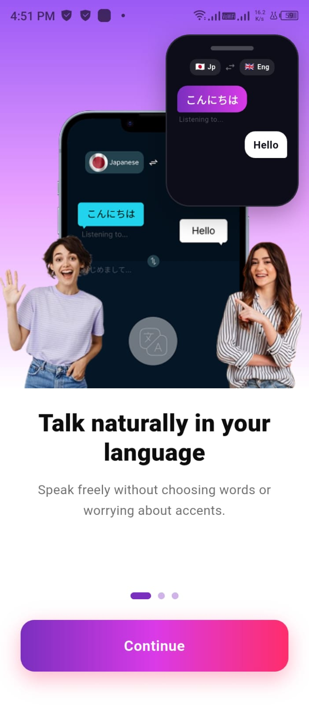
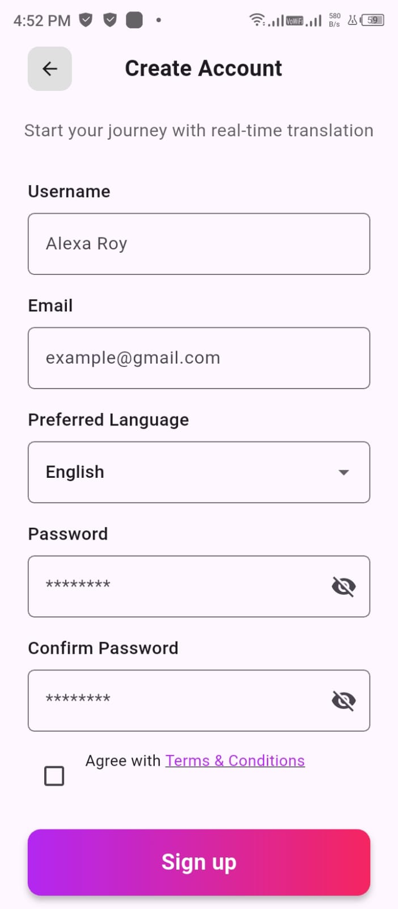
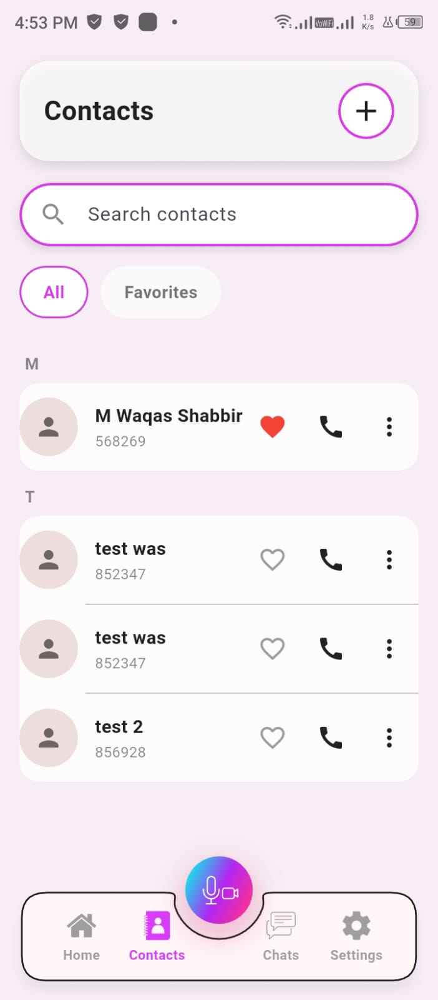
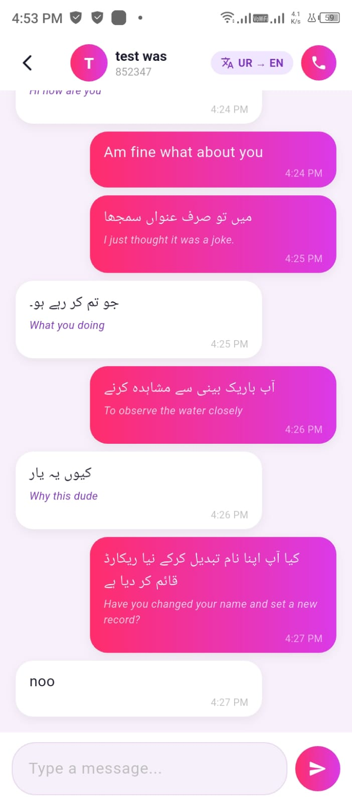
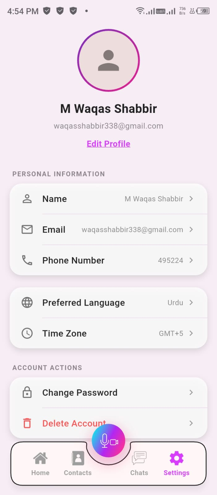
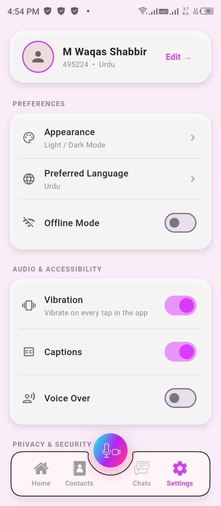

# LinguaCall AI 🌐📞

> **Break language barriers in real-time** — A Flutter-based AI Translation Calling App that enables seamless communication across different languages through live speech transcription, automatic translation, and text-to-speech assistance.

<p align="center">
  
  &nbsp;&nbsp;
  
  &nbsp;&nbsp;
  
</p>

---

## 🔗 Live App & Download

| Platform | Link |
|----------|------|
| 🌐 **Web App** | [Open LinguaCall AI](https://linguacall-ai.vercel.app) |
| 📱 **Android APK** | [Download APK from Releases](../../releases/latest) |
| 📂 **Source Code** | [github.com/Waqas337/linguacall-ai](https://github.com/Waqas337/linguacall-ai) |

---

## 🎯 Problem Statement

People who speak different languages struggle to communicate during online calls. Existing apps provide basic calling but no real-time language assistance. **LinguaCall AI** solves this by combining WebRTC calling with AI-powered live speech transcription, automatic translation, and voice output — all in one app.

---

## 👥 Demo Credentials

Two accounts are provided because the calling and chat features require a **caller** and a **receiver**.

### 📞 Caller Account
```
Email:    waqas@gmail.com
Password: 123456
```

### 📱 Receiver Account
```
Email:    waqasshabbir338@gmail.com
Password: 123456
```

> ⚠️ These accounts are for project evaluation only. Please do not change passwords.

---

## ✨ Key Features

| Feature | Description |
|---------|-------------|
| 🔐 **Authentication** | Firebase email/password login & signup |
| 📞 **Video Calling** | Real-time peer-to-peer WebRTC calls |
| ⚙️ **Preferred Language** | Change your language in Settings — translation in calls and chat updates automatically |
| 🎙️ **Live Captions** | Speech-to-text via Deepgram during calls |
| 🌍 **Auto Translation** | Google Translate — 10 languages |
| 🔊 **Voice Output** | Translated text spoken via Flutter TTS |
| 💬 **Translated Chat** | Messages auto-translated for receiver |
| 🔢 **6-Digit Number** | Unique calling number (no phone needed) |
| 👥 **Contacts** | Add, edit, favorite and manage contacts |
| 📋 **Recent Calls** | Call history with direction indicators |
| 🔔 **Notifications** | Incoming call alerts via FCM |
| 🌐 **10 Languages** | English, Urdu, Arabic, French, Spanish, Italian, German, Japanese, Turkish, Chinese |

---

## 📸 Screenshots

### Onboarding & Authentication
<p align="center">
  
  &nbsp;
  
  &nbsp;
  
  &nbsp;
  
</p>

### Main App
<p align="center">
  
  &nbsp;
  
  &nbsp;
  
</p>

### Settings & Profile
<p align="center">
  
  &nbsp;
  
</p>

---

## 🤖 AI-Powered Features

### How the AI Pipeline Works

```
User Speaks During Call
        ↓
Deepgram Speech-to-Text (nova-2 model)
        ↓
Transcript Text Generated
        ↓
Google Cloud Translation API
        ↓
Translated to Receiver's Language
        ↓
Caption Shown on Receiver's Screen
        ↓
Flutter TTS Reads Caption Aloud (optional)
```

### AI Services Used

| Service | Purpose | Model/API |
|---------|---------|-----------|
| **Deepgram** | Speech-to-Text | nova-2, 16kHz WAV |
| **Google Cloud Translate** | Language Translation | REST API v2 |
| **Flutter TTS** | Text-to-Speech | Device native TTS |

### Supported Languages
`English` `Urdu` `Arabic` `French` `Spanish` `Italian` `German` `Japanese` `Turkish` `Chinese`

---

## 🛠️ Tech Stack

### Frontend
- **Flutter** — Cross-platform framework
- **Dart** — Programming language
- **Material Design** — UI components

### Backend & Cloud
- **Firebase Authentication** — User login/signup
- **Cloud Firestore** — Real-time NoSQL database
- **Firebase Cloud Messaging** — Push notifications
- **Firebase Cloud Functions** — Server-side call triggers

### Real-Time Communication
- **WebRTC** (`flutter_webrtc`) — P2P audio/video
- **Firestore Signaling** — SDP & ICE exchange
- **STUN Server** — Public IP discovery
- **TURN Server** (Metered) — NAT traversal relay

---

## 🏗️ System Architecture

```
Flutter Mobile App
        │
        ├── Firebase Authentication
        │
        ├── Cloud Firestore (Real-time DB)
        │       ├── users/
        │       ├── numbers/
        │       ├── contacts/
        │       ├── calls/
        │       ├── rooms/ (WebRTC signaling)
        │       └── chats/
        │
        ├── WebRTC Engine
        │       ├── SDP Offer/Answer
        │       ├── ICE Candidates
        │       ├── STUN Server
        │       └── TURN Server
        │
        └── AI Services
                ├── Deepgram STT
                ├── Google Translate
                └── Flutter TTS
```

---

## 📂 Firestore Database Structure

| Collection | Data |
|-----------|------|
| `users/{uid}` | name, email, number, photoUrl, preferredLanguageCode, fcmToken |
| `numbers/{number}` | uid — maps 6-digit number to Firebase UID |
| `users/{uid}/contacts` | savedName, number, favorite |
| `users/{uid}/recentCalls` | otherNumber, direction, callType, timestamp |
| `calls/{uid}` | roomId, fromUid, fromNumber, status |
| `rooms/{roomId}` | offer, answer, ICE candidates |
| `rooms/{roomId}/captions` | live transcribed text |
| `chats/{chatId}` | participants, lastMessage, lastMessageTime |
| `chats/{chatId}/messages` | senderId, originalText, translatedText, read |

---

## 🧪 How to Test the Calling Feature

### Step 1 — Setup
1. Open the app on **two devices** (or two browser tabs for web)
2. Login with **Caller Account** on Device 1
3. Login with **Receiver Account** on Device 2

### Step 2 — Change Preferred Language
4. On **Device 1** → Go to **Settings** → Select your language (e.g. English)
5. On **Device 2** → Go to **Settings** → Select a different language (e.g. Urdu or Chinese)
> ✅ This ensures translation happens during both calls and chat

### Step 3 — Make a Call
6. On Device 1 → Enter receiver's **6-digit number** → Tap **Call**
7. On Device 2 → Accept the **incoming call**
8. Allow **microphone & camera** permissions on both devices

### Step 4 — Test AI Translation
9. Speak from **caller side** in your language
10. Watch **live captions** appear on receiver's screen in their language
11. If **Voice Over** is ON in Settings → receiver will also **hear** the translation

### Step 5 — Test Chat
12. Open **Chat** during or after call
13. Type a message in your language
14. Receiver sees the message **automatically translated** in their language
15. Both original and translated text are visible

### Step 6 — Test Controls
16. Test **Mute** / **Unmute** microphone
17. Test **Camera ON/OFF** toggle
18. Test **Disconnect** call button

> 💡 **Tip:** Set caller language to English and receiver language to Urdu or Chinese for best translation demo.

---

## ⚙️ Local Setup Instructions

### Prerequisites
- Flutter SDK installed
- Android Studio or VS Code
- Android device or emulator
- Firebase project configured

### Steps

```bash
# 1. Clone the repository
git clone https://github.com/Waqas337/linguacall-ai.git
cd linguacall-ai

# 2. Install dependencies
flutter pub get

# 3. Run the app
flutter run
```

### Environment Variables
Copy `.env.example` and create your own `.env`:
```bash
cp .env.example .env
```

Or run with dart-define:
```bash
flutter run \
  --dart-define=DEEPGRAM_API_KEY=your_key \
  --dart-define=GOOGLE_TRANSLATE_API_KEY=your_key
```

### Build APK
```bash
flutter build apk --release
```
APK output: `build/app/outputs/flutter-apk/app-release.apk`

---

## 🔑 Key Terminologies

| Term | Explanation |
|------|-------------|
| **WebRTC** | Real-time peer-to-peer audio/video communication |
| **Signaling** | Process of exchanging call setup data via Firestore |
| **SDP** | Session Description Protocol — describes call media settings |
| **ICE Candidate** | Network path information for P2P connection |
| **STUN Server** | Finds public IP behind NAT |
| **TURN Server** | Relays media when direct P2P fails |
| **P2P** | Direct connection without central server |
| **STT** | Speech-to-Text — Deepgram converts voice to text |
| **TTS** | Text-to-Speech — converts translated text to voice |
| **FCM** | Firebase Cloud Messaging — push notifications |
| **UID** | Firebase unique user identifier |
| **Chat ID** | Sorted UIDs joined — unique per conversation |

---

## 🔒 Security

- API keys are not committed to the repository
- `.env` file excluded via `.gitignore`
- Firebase Authentication manages all passwords
- Firestore Security Rules restrict unauthorized access
- Demo accounts contain no personal data
- Service account JSON files not included

---

## 🚀 Future Improvements

- Group video calling
- End-to-end encrypted messages
- More language support
- Backend API proxy for API keys
- Call recording with consent
- Offline message queue

---

## 👤 Author

**Muhammad Waqas Shabbir**  
Flutter Developer  
Project: LinguaCall AI — WebRTC Real-Time Translation Calling App  
Submission: Final Project — Ship Your AI App  

---

## ⚠️ Disclaimer

This project was independently designed and developed as individual work. It is not a copied repository, shared submission, or renamed tutorial project. The application combines WebRTC, Firebase, Deepgram, and Google Translate in a complete workflow built from scratch.

---

<p align="center">
  Made with ❤️ using Flutter & Firebase
</p>
